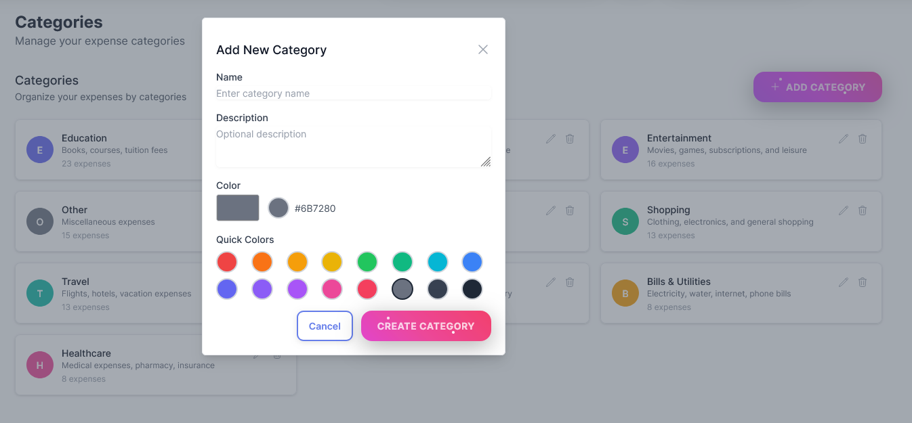
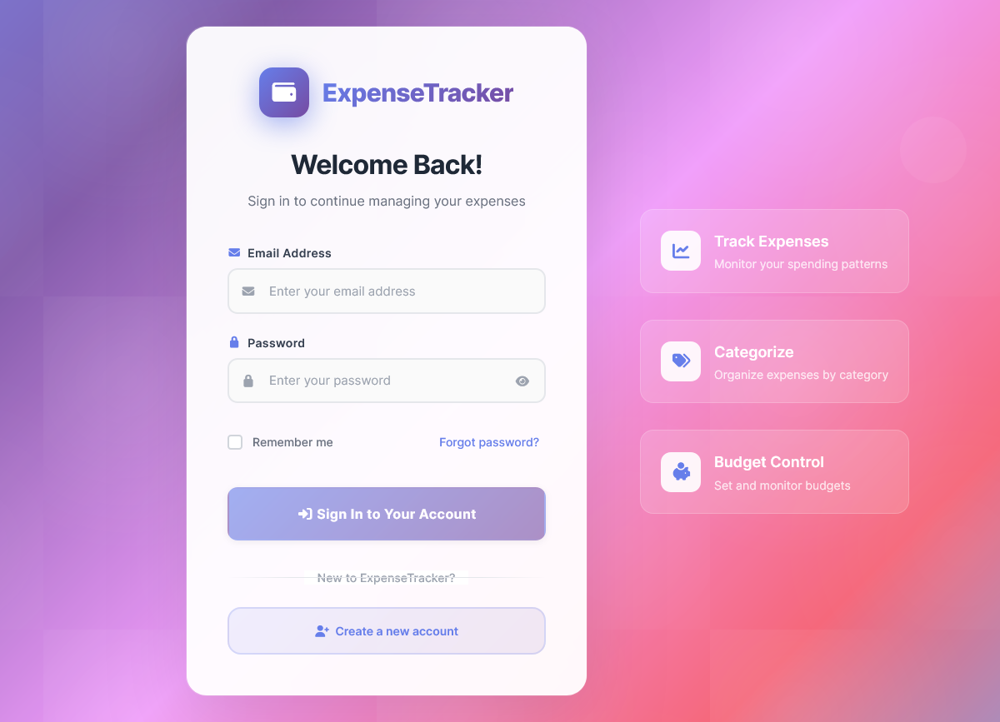

# 💰 Expense Tracker - Laravel + Vue.js

<div align="center">


**A modern, full-stack expense tracking application with powerful analytics and intuitive design**

[🚀 Features](#-features) • [📷 Screenshots](#-screenshots) • [⚡ Quick Start](#-quick-start) • [📖 Documentation](#-api-documentation)

</div>

---

## 🌟 Overview

Expense Tracker is a comprehensive financial management application built with modern web technologies. It combines the robustness of Laravel 12 backend with the reactivity of Vue.js 3 frontend to deliver a seamless expense tracking experience with powerful analytics and insights.

### 🏗️ Architecture

This application follows a **decoupled microservices architecture**:

- **🔧 Backend**: Laravel 12 RESTful API with Sanctum authentication
- **🎨 Frontend**: Vue.js 3 SPA with Composition API and modern tooling
- **📊 Database**: MySQL with optimized queries and proper indexing
- **🔐 Security**: Token-based authentication with CORS protection

---

## 🚀 Features

### 💡 Core Functionality
- ✅ **Secure Authentication**: JWT/Sanctum authentication with secure API endpoints
- ✅ **RESTful API**: Laravel 12 with comprehensive API documentation
- ✅ **Modern Frontend**: Vue.js 3 with Composition API and TypeScript support
- ✅ **State Management**: Pinia for reactive and efficient state handling
- ✅ **Real-time Tracking**: Live expense tracking with instant updates
- ✅ **Smart Categorization**: Intelligent expense categorization with color coding
- ✅ **Responsive Design**: Mobile-first design with Tailwind CSS
- ✅ **Form Validation**: Comprehensive validation on both frontend and backend
- ✅ **Repository Pattern**: Clean architecture with Eloquent ORM
- ✅ **Consistent APIs**: API resources for standardized response formatting
- ✅ **Error Handling**: Robust error handling and user feedback
- ✅ **Sample Data**: Database seeders with realistic demo data

### 📊 Dashboard Analytics
- 📈 **Monthly Expense Trends**: Interactive line charts showing spending patterns over time
- 🍰 **Category Breakdown**: Beautiful doughnut charts with spending distribution
- 📋 **Summary Cards**: Key metrics and statistics with trend indicators
- 📅 **Date Range Filtering**: Custom date range selection for detailed analysis
- 💰 **Real-time Calculations**: Live updates of totals, averages, and percentages
- 🔍 **Advanced Search**: Full-text search with category and date filters
- 📱 **Mobile Optimized**: Responsive charts and tables for all devices

### 🧠 Advanced Analytics & Financial Health ⭐ *Recently Enhanced*
- 💚 **Financial Health Score**: Comprehensive scoring system with multiple metrics
  - Overall health score calculation (0-100 scale)
  - Budget adherence tracking and alerts
  - Spending consistency analysis
  - Savings rate monitoring
  - Category balance assessment
- 📊 **Intelligent Insights**: AI-powered spending pattern detection
  - Recurring payment identification
  - Seasonal spending trends
  - Category spike alerts
  - Anomaly detection
- 🎯 **Personalized Recommendations**: Smart suggestions for better financial health
- 📈 **Predictive Analytics**: Spending forecasts and trend predictions
- 🚨 **Smart Alerts**: Budget warnings and spending notifications
- 📋 **Historical Analysis**: 12-month financial health trend tracking
- 🔄 **Real-time Updates**: Live analytics with cached performance optimization

### 💰 Budget Management *New Feature*
- 🎯 **Smart Budget Creation**: Create budgets by category with flexible periods
- 📊 **Budget Tracking**: Real-time budget vs. actual spending monitoring
- 🚨 **Intelligent Alerts**: Customizable budget alerts at 50%, 75%, and 90% usage
- 📈 **Budget Analytics**: Historical budget performance and trends
- 💡 **Budget Recommendations**: AI-powered budget suggestions based on spending patterns
- 🔄 **Flexible Periods**: Support for monthly, quarterly, and yearly budgets
- 📱 **Mobile Budget Cards**: Beautiful responsive budget visualization

---

## 🔧 Recent Updates & Bug Fixes

### ✅ **Analytics System Fixes**

**Fixed Critical Issues:**
- 🛠️ **Database Schema Alignment**: Resolved table name mismatches between migrations and models
- 🔧 **AnalyticsCache Model**: Fixed table name from `analytics_caches` to `analytics_cache`  
- 📊 **Financial Health Calculation**: Resolved "Failed to calculate financial health" errors
- 🔍 **SQL Query Optimization**: Fixed ambiguous column references in join queries
- 📋 **UserInsight Storage**: Updated column mappings to match database schema
- ⚡ **SpendingPattern Creation**: Added proper frequency field handling

**Technical Improvements:**
- Enhanced error handling in AnalyticsService
- Improved database query performance
- Added comprehensive debug logging
- Implemented proper model relationships
- Optimized cache management for analytics data

**Verification Results:**
- ✅ Financial health score calculation working
- ✅ All analytics endpoints returning proper data
- ✅ Budget tracking and alerts functioning correctly
- ✅ User insights generation operational
- ✅ Spending pattern detection active

### � **New Features Added**
- 🧠 **Advanced Analytics Engine**: Comprehensive financial health scoring
- 💰 **Budget Management System**: Smart budget creation and tracking
- 🎯 **Intelligent Alerts**: Proactive budget and spending notifications  
- 📊 **Predictive Analytics**: Spending forecasts and trend analysis
- 🔄 **Real-time Updates**: Live analytics with optimized caching
- 🏷️ **Smart Categories**: Pre-defined categories with custom colors and icons
- 📝 **Detailed Records**: Rich expense descriptions with optional notes
- 🔄 **Bulk Operations**: Edit and delete multiple expenses efficiently
- 📤 **Data Export**: Export expense data in various formats
- 🔔 **Smart Notifications**: Spending alerts and budget warnings
- 📊 **Pagination**: Efficient handling of large datasets (15 items per page)
- 🎯 **Quick Actions**: Fast expense entry with keyboard shortcuts

### 🚀 Laravel 12 Enhancements
- ⚡ **Enhanced Performance**: Optimized queries and caching mechanisms
- 🛠️ **Developer Experience**: Improved debugging and development tools
- 🔧 **Modern PHP**: Full PHP 8.2+ features support with strict typing
- 🧪 **Advanced Testing**: PHPUnit 11 with comprehensive test coverage
- 🏗️ **Clean Architecture**: Service container and dependency injection
- 📦 **Package Management**: Latest Composer dependencies and optimizations
- 🧠 **Analytics Engine**: Advanced analytics service with financial health scoring
- 🔧 **Database Optimizations**: Proper table schemas and model relationships
- 🚨 **Error Handling**: Comprehensive exception handling and logging

---

## 📷 Screenshots

### 🏠 Dashboard Overview
> *Comprehensive analytics with interactive charts and real-time insights*


**Key Features Shown:**
- Monthly spending trends with interactive line charts
- Category breakdown with colorful doughnut charts  
- Summary cards showing total expenses, average spending, and category counts
- Recent expense activity with quick action buttons
- Responsive design that works on all devices

### 📊 Expense Management  
> *Efficient expense tracking with advanced filtering and search capabilities*


**Features Highlighted:**
- Paginated expense list with 15 items per page for optimal performance
- Advanced search and filtering by category, date range, and description
- Quick edit and delete actions with confirmation dialogs
- Category color coding for visual organization
- Mobile-responsive table design

### 🏷️ Category Management
> *Organize expenses with color-coded categories and real-time expense counts*



**Category Features:**
- Visual category cards with custom colors and expense counts
- Quick category creation with form validation
- Real-time updates when expenses are added or removed
- Category-based filtering and search functionality

### Budget Management


**Budget Management Features:**

- **Real-time Calculations**: Spent amounts calculated dynamically from expenses
- **Usage Percentages**: Progress tracking with visual indicators
- **Remaining Amounts**: Shows available budget left
- **Day-by-day Tracking**: Daily average and projected totals

### Advanced Analytics


**Analytics Features:**
- Total Spending
- Daily average
- Monthly forecast


### 🔐 Authentication
> *Secure login system with modern UI design*




**Security Features:**
- JWT/Sanctum token-based authentication
- Form validation with real-time feedback
- Secure password handling with BCrypt hashing
- Remember me functionality for better UX

### 📱 Mobile Experience
> *Fully responsive design optimized for mobile devices*


**Mobile Optimizations:**
- Touch-friendly interface with larger buttons
- Swipe gestures for quick actions
- Optimized charts and data visualization for small screens
- Progressive Web App (PWA) capabilities

---

## ⚡ Quick Start

> **Get up and running in 5 minutes with our automated setup scripts!**

### 🚀 One-Command Setup

**Windows Users:**
```bash
# Clone the repository
git clone https://github.com/shakhawatmollah/expense-tracker.git
cd expense-tracker

# Run the automated setup script
setup.bat
```

**Unix/Linux/macOS Users:**
```bash
# Clone the repository  
git clone https://github.com/shakhawatmollah/expense-tracker.git
cd expense-tracker

# Make script executable and run
chmod +x setup.sh
./setup.sh
```

The setup script will:
- ✅ Install PHP and Node.js dependencies
- ✅ Configure environment files
- ✅ Set up the database with sample data
- ✅ Start both backend and frontend servers
- ✅ Open the application in your browser

### 🎯 Demo Access

After setup, login with these **pre-configured accounts**:

| 👤 User Type | 📧 Email | 🔑 Password | 📊 Data |
|-------------|----------|-------------|---------|
| **Demo User** | `demo@example.com` | `demo123` | Full sample data |
| **Regular User** | `john@example.com` | `password123` | 6 months of expenses |
| **Admin User** | `admin@example.com` | `admin123` | Administrative access |

### 🏁 Manual Setup (Alternative)

If you prefer manual setup, follow the [detailed installation guide](#-installation) below.

---

## 🛠️ Requirements

### Backend
- PHP 8.2 or higher
- MySQL 5.7+ or MariaDB 10.3+
- Composer 2.0+
- Laravel 12

### Key Dependencies
- **Laravel Framework**: ^12.0
- **Laravel Sanctum**: ^4.2 (API Authentication)
- **Laravel Tinker**: ^2.9 (Interactive Console)
- **Laravel Sail**: ^1.30 (Docker Development Environment)
- **PHPUnit**: ^11.0 (Testing Framework)
- **Laravel Pint**: ^1.13 (Code Formatting)

### Frontend
- Node.js 18+ and npm
- Modern web browser with ES6+ support

## 📦 Installation

### 🔧 Backend Setup (Laravel API)

#### 1️⃣ **Navigate to Backend Directory**
```bash
cd backend
```

#### 2️⃣ **Install Dependencies**
```bash
# Install PHP dependencies with Composer
composer install

# For development with additional tools
composer install --dev
```

#### 3️⃣ **Environment Configuration**
```bash
# Copy environment template
cp .env.example .env
```

**Configure your `.env` file:**
```env
# Database Configuration
DB_CONNECTION=mysql
DB_HOST=localhost
DB_PORT=3306
DB_DATABASE=expense_tracker
DB_USERNAME=your_username
DB_PASSWORD=your_password

# Sanctum Configuration for API Authentication
SANCTUM_STATEFUL_DOMAINS=localhost:3000,127.0.0.1:3000
SESSION_DOMAIN=localhost
SPA_URL=http://localhost:3000

# Application Settings
APP_NAME="Expense Tracker"
APP_ENV=local
APP_DEBUG=true
APP_URL=http://localhost:8000
```

#### 4️⃣ **Generate Application Key**
```bash
php artisan key:generate
```

#### 5️⃣ **Database Setup**
```sql
-- Create database
CREATE DATABASE expense_tracker CHARACTER SET utf8mb4 COLLATE utf8mb4_unicode_ci;
```

```bash
# Run migrations
php artisan migrate

# Publish Sanctum configuration
php artisan vendor:publish --provider="Laravel\Sanctum\SanctumServiceProvider"

# Optional: Seed with sample data
php artisan db:seed
```

#### 6️⃣ **Start Development Server**
```bash
# Start Laravel development server
php artisan serve

# Server will be available at: http://localhost:8000
```

### 🎨 Frontend Setup (Vue.js)

#### 1️⃣ **Navigate to Frontend Directory**
```bash
cd frontend
```

#### 2️⃣ **Install Node Dependencies**
```bash
# Install with npm
npm install

# Or with yarn
yarn install
```

#### 3️⃣ **Environment Configuration**
Create `.env` file in frontend directory:
```env
# API Configuration
VITE_API_BASE_URL=http://localhost:8000/api
VITE_APP_NAME="Expense Tracker"

# Optional: Enable debug mode
VITE_DEBUG=true
```

#### 4️⃣ **Start Development Server**
```bash
# Start Vite development server
npm run dev

# Or with yarn
yarn dev

# Frontend will be available at: http://localhost:3000
```

### 🐳 Docker Development (Alternative)

For a **containerized development environment** using Laravel Sail:

#### 1️⃣ **Start with Sail**
```bash
cd backend

# Start all services (MySQL, Redis, Mailhog)
./vendor/bin/sail up -d

# Or with specific services
./vendor/bin/sail up -d mysql redis
```

#### 2️⃣ **Run Commands in Container**
```bash
# Run migrations
./vendor/bin/sail artisan migrate

# Seed database
./vendor/bin/sail artisan db:seed

# Run tests
./vendor/bin/sail test

# Access container shell
./vendor/bin/sail shell
```

#### 3️⃣ **Access Services**
- **Backend API**: `http://localhost`
- **Database**: `localhost:3306`
- **Redis**: `localhost:6379`
- **Mailhog**: `http://localhost:8025`

### 🌱 Database Seeders & Sample Data

This application includes comprehensive database seeders that populate the database with realistic sample data for testing and demonstration purposes.

### Available Seeders

1. **UserSeeder**: Creates demo users with pre-configured credentials
2. **CategorySeeder**: Adds default expense categories with colors and descriptions
3. **ExpenseSeeder**: Generates realistic expense data across multiple months

### Quick Setup with Sample Data

#### Option 1: Using Seeder Scripts (Recommended)

**Windows:**
```bash
# Run the batch file for Windows users
seed-database.bat
```

**Unix/Linux/macOS:**
```bash
# Make the script executable and run
chmod +x seed-database.sh
./seed-database.sh
```

#### Option 2: Manual Commands

```bash
cd backend

# Fresh installation with sample data
php artisan migrate:fresh --seed

# Or run individual seeders
php artisan migrate:fresh
php artisan db:seed --class=UserSeeder
php artisan db:seed --class=CategorySeeder
php artisan db:seed --class=ExpenseSeeder

# Or run all seeders
php artisan db:seed
```

### Demo Login Credentials

After running the seeders, you can login with these demo accounts:

| Email | Password | Role |
|-------|----------|------|
| `demo@example.com` | `demo123` | Demo User |
| `john@example.com` | `password123` | Regular User |
| `jane@example.com` | `password123` | Regular User |
| `admin@example.com` | `admin123` | Admin User |

### Sample Data Overview

The seeders create:

- **4 Demo Users** + 10 additional random users via factories
- **10 Default Categories** per user with realistic colors and descriptions:
  - 🍽️ Food & Dining (Red - #EF4444)
  - 🚗 Transportation (Blue - #3B82F6)
  - 🛍️ Shopping (Green - #10B981)
  - 🎬 Entertainment (Purple - #8B5CF6)
  - ⚡ Bills & Utilities (Yellow - #F59E0B)
  - 🏥 Healthcare (Pink - #EC4899)
  - 📚 Education (Indigo - #6366F1)
  - ✈️ Travel (Teal - #14B8A6)
  - 💅 Personal Care (Orange - #F97316)
  - 📦 Other (Gray - #6B7280)

- **15-30 Realistic Expenses** per month for each user across the last 6 months
- **Expense amounts** that vary based on category (e.g., rent: $800-1500, coffee: $4-8)
- **Real-world descriptions** for each expense type
- **Proper date distribution** across months for trend analysis

### Categories & Expense Types

Each category includes realistic expense examples:

**Food & Dining:**
- Lunch at McDonald's ($8-15)
- Dinner at Italian Restaurant ($25-60)
- Grocery Shopping ($45-120)
- Coffee at Starbucks ($4-8)

**Transportation:**
- Gas Fill-up ($30-60)
- Uber Ride ($8-25)
- Public Transit Pass ($15-30)
- Car Maintenance ($50-200)

**And many more across all categories...**

### Seeder Configuration

The seeders are designed to be:
- **Idempotent**: Safe to run multiple times
- **Realistic**: Uses proper expense amounts and descriptions
- **Flexible**: Easy to modify for different data needs
- **Performance-friendly**: Optimized for quick execution

### Customizing Sample Data

To modify the sample data:

1. **Edit UserSeeder.php** to change demo users
2. **Edit CategorySeeder.php** to modify default categories
3. **Edit ExpenseSeeder.php** to adjust expense patterns and amounts

### Resetting Data

To start fresh with new sample data:
```bash
cd backend
php artisan migrate:fresh --seed
```

This will drop all tables, recreate them, and populate with fresh sample data.

### Verifying Seeded Data

To check if the seeders worked correctly:

**Windows:**
```bash
verify-data.bat
```

**Unix/Linux/macOS:**
```bash
chmod +x verify-data.sh
./verify-data.sh
```

This will show you the count of users, categories, and expenses in the database.

## Development Workflow

1. Start the Laravel backend: `cd backend && php artisan serve`
2. Start the Vue.js frontend: `cd frontend && npm run dev`
3. Access the application at `http://localhost:3000`
4. Login with demo credentials to explore features

## 🛠️ Technology Stack

### 🔧 Backend Technologies
| Technology | Version | Purpose |
|------------|---------|---------|
| **Laravel** | v12.0 | PHP web framework with modern features |
| **PHP** | v8.2+ | Server-side programming language |
| **MySQL** | v8.0+ | Relational database management |
| **Laravel Sanctum** | v4.2 | API authentication system |
| **PHPUnit** | v11.0 | Testing framework |
| **Composer** | v2.0+ | PHP dependency management |

### 🎨 Frontend Technologies  
| Technology | Version | Purpose |
|------------|---------|---------|
| **Vue.js** | v3.4+ | Progressive JavaScript framework |
| **TypeScript** | v5.0+ | Type-safe JavaScript development |
| **Vite** | v5.0+ | Fast build tool and development server |
| **Pinia** | v2.1+ | State management for Vue.js |
| **Tailwind CSS** | v3.4+ | Utility-first CSS framework |
| **Chart.js** | v4.4+ | Interactive charts and data visualization |
| **Axios** | v1.6+ | HTTP client for API communication |

### 🔧 Development Tools
| Tool | Purpose |
|------|---------|
| **Laravel Pint** | Code formatting and style checking |
| **ESLint** | JavaScript/TypeScript linting |
| **Prettier** | Code formatting for frontend |
| **Laravel Tinker** | Interactive PHP REPL |
| **Vue DevTools** | Vue.js debugging and development |

### 🚀 Production Technologies
| Technology | Purpose |
|------------|---------|
| **Laravel Sail** | Docker development environment |
| **Nginx** | Web server for production deployment |
| **Redis** | Caching and session storage |
| **Supervisor** | Process management for queues |

---

## 📁 Project Structure

```
expense-tracker/
├── backend/ (Laravel 12)
│   ├── app/
│   │   ├── Http/
│   │   │   ├── Controllers/Api/     # API Controllers
│   │   │   │   ├── AnalyticsController.php    # 🧠 Advanced analytics ⭐
│   │   │   │   ├── BudgetController.php       # 💰 Budget management ⭐
│   │   │   │   ├── ExpenseController.php      # Expense operations
│   │   │   │   └── CategoryController.php     # Category management
│   │   │   ├── Requests/           # Form validation
│   │   │   ├── Resources/          # API response formatting
│   │   │   └── Middleware/         # Custom middleware
│   │   ├── Models/                 # Eloquent models
│   │   │   ├── AnalyticsCache.php          # 🔧 Fixed table mapping ⭐
│   │   │   ├── FinancialHealthScore.php    # 📊 Health scoring ⭐
│   │   │   ├── SpendingPattern.php         # 🔍 Pattern detection ⭐
│   │   │   ├── UserInsight.php             # 💡 User insights ⭐
│   │   │   ├── Budget.php                  # 💰 Budget model ⭐
│   │   │   ├── Expense.php
│   │   │   └── Category.php
│   │   ├── Services/               # Business logic services
│   │   │   ├── AnalyticsService.php        # 🧠 Analytics engine ⭐
│   │   │   ├── BudgetService.php           # 💰 Budget logic ⭐
│   │   │   └── ValidationService.php
│   │   ├── Repositories/           # Data access layer
│   │   └── Exceptions/             # Custom exceptions
│   ├── database/
│   │   ├── migrations/             # Database migrations
│   │   │   ├── 2025_10_17_121519_create_analytics_tables.php  # 📊 Analytics schema ⭐
│   │   │   ├── 2025_10_17_120341_create_budgets_table.php     # 💰 Budget schema ⭐
│   │   │   └── ...existing migrations
│   │   ├── seeders/               # Database seeders ⭐
│   │   │   ├── UserSeeder.php     # Demo users with credentials
│   │   │   ├── CategorySeeder.php # Default expense categories
│   │   │   ├── ExpenseSeeder.php  # Realistic sample expenses
│   │   │   └── DatabaseSeeder.php # Main seeder orchestrator
│   │   └── factories/             # Model factories
│   ├── routes/api.php             # API routes
│   ├── tests/                     # Backend tests
│   └── composer.json              # PHP dependencies
│
├── frontend/ (Vue.js 3 + Vite)
│   ├── src/
│   │   ├── components/            # Vue components
│   │   │   ├── layout/           # Layout components
│   │   │   ├── auth/             # Authentication forms
│   │   │   ├── expenses/         # Expense components
│   │   │   ├── categories/       # Category components
│   │   │   ├── budgets/          # 💰 Budget components ⭐
│   │   │   │   ├── BudgetCard.vue        # Budget display cards
│   │   │   │   ├── BudgetForm.vue        # Budget creation/editing
│   │   │   │   └── BudgetAlerts.vue      # Budget alert notifications
│   │   │   ├── analytics/        # 🧠 Analytics components ⭐
│   │   │   │   ├── FinancialHealth.vue   # Health score display
│   │   │   │   ├── SpendingPatterns.vue  # Pattern visualization
│   │   │   │   └── InsightCards.vue      # User insights
│   │   │   ├── dashboard/        # Dashboard widgets ⭐
│   │   │   │   ├── ExpenseChart.vue      # Monthly trends chart
│   │   │   │   ├── CategoryBreakdown.vue # Category doughnut chart
│   │   │   │   └── SummaryCards.vue      # Statistics cards
│   │   │   └── common/           # Reusable components
│   │   ├── views/                # Page components
│   │   │   ├── Analytics.vue             # 🧠 Advanced analytics page ⭐
│   │   │   ├── BudgetManagement.vue      # 💰 Budget management page ⭐
│   │   │   └── ...existing pages
│   │   ├── stores/               # Pinia stores
│   │   │   ├── analytics.js              # 📊 Analytics state ⭐
│   │   │   ├── budget.js                 # 💰 Budget state ⭐
│   │   │   └── ...existing stores
│   │   ├── services/             # API services
│   │   ├── router/               # Vue Router config
│   │   ├── composables/          # Vue composables
│   │   └── assets/               # Static assets
│   ├── package.json              # Node.js dependencies
│   └── vite.config.js            # Vite configuration
│
├── seed-database.sh               # Unix seeder script ⭐
├── seed-database.bat              # Windows seeder script ⭐
├── verify-data.sh                 # Unix data verification script ⭐
└── verify-data.bat                # Windows data verification script ⭐
```

## API Endpoints

### Authentication
- `POST /api/auth/register` - Register new user
- `POST /api/auth/login` - Login user
- `POST /api/auth/logout` - Logout user
- `GET /api/auth/me` - Get authenticated user

### Expenses
- `GET /api/expenses` - List user expenses
- `POST /api/expenses` - Create new expense
- `GET /api/expenses/{id}` - Get specific expense
- `PUT /api/expenses/{id}` - Update expense
- `DELETE /api/expenses/{id}` - Delete expense
- `GET /api/expenses/search` - Search expenses
- `GET /api/expenses/date-range` - Get expenses by date range

### Categories
- `GET /api/categories` - List user categories
- `POST /api/categories` - Create new category
- `GET /api/categories/{id}` - Get specific category
- `PUT /api/categories/{id}` - Update category
- `DELETE /api/categories/{id}` - Delete category

### Budgets ⭐ *New*
- `GET /api/budgets` - List user budgets with usage statistics
- `POST /api/budgets` - Create new budget
- `GET /api/budgets/{id}` - Get specific budget details
- `PUT /api/budgets/{id}` - Update budget
- `DELETE /api/budgets/{id}` - Delete budget
- `GET /api/budgets/summary` - Budget summary with current period data
- `GET /api/budgets/alerts` - Budget alerts and warnings
- `GET /api/budgets/analytics` - Budget performance analytics

### Advanced Analytics ⭐ *Recently Fixed*
- `GET /api/analytics/dashboard` - Comprehensive analytics dashboard
- `GET /api/analytics/financial-health` - Financial health score and metrics
- `GET /api/analytics/patterns` - Spending pattern detection
- `GET /api/analytics/insights` - User insights and recommendations
- `GET /api/analytics/forecasts` - Spending forecasts and predictions
- `GET /api/analytics/trends` - Detailed spending trend analysis
- `POST /api/analytics/refresh` - Force analytics cache refresh

### Dashboard
- `GET /api/dashboard` - Get dashboard statistics
- `GET /api/dashboard/monthly-summary` - Monthly summary
- `GET /api/dashboard/yearly-summary` - Yearly summary
- `GET /api/dashboard/trends` - Expense trends

## 📖 API Documentation

### 📋 Postman Collection

We provide a **comprehensive Postman collection** with all API endpoints, authentication, and sample data:

- **📁 Collection File**: `Expense_Tracker_API.postman_collection.json`
- **🌍 Environment File**: `Expense_Tracker.postman_environment.json`
- **📖 Documentation**: `POSTMAN_API_DOCUMENTATION.md`

#### 🚀 Quick Import
1. Open Postman
2. Import the collection and environment files
3. Set `base_url` to `http://localhost:8000/api`
4. Login with demo credentials to auto-populate the auth token
5. Start testing all endpoints immediately!

### 🔐 Authentication Endpoints
```
POST   /api/auth/register     # Register new user
POST   /api/auth/login        # Login user
GET    /api/auth/me          # Get current user
POST   /api/auth/logout      # Logout user
```

### 💰 Expense Endpoints
```
GET    /api/expenses                    # List expenses (with pagination)
POST   /api/expenses                    # Create expense
GET    /api/expenses/{id}              # Get specific expense
PUT    /api/expenses/{id}              # Update expense
DELETE /api/expenses/{id}              # Delete expense
GET    /api/expenses/search            # Search expenses
GET    /api/expenses/date-range        # Get by date range
```

### 🏷️ Category Endpoints
```
GET    /api/categories                 # List categories (with expense counts)
POST   /api/categories                 # Create category
GET    /api/categories/{id}           # Get specific category
PUT    /api/categories/{id}           # Update category
DELETE /api/categories/{id}           # Delete category
```

### 📊 Dashboard & Analytics
```
GET    /api/dashboard                  # Dashboard overview
GET    /api/dashboard/monthly-summary  # Monthly analysis
GET    /api/dashboard/yearly-summary   # Yearly statistics
GET    /api/dashboard/trends           # Spending trends
GET    /api/dashboard/daily-spending   # Daily breakdown
```

### 💰 Budget Management ⭐ *New*
```
GET    /api/budgets                    # List budgets with statistics
POST   /api/budgets                    # Create budget
GET    /api/budgets/{id}              # Get specific budget
PUT    /api/budgets/{id}              # Update budget
DELETE /api/budgets/{id}              # Delete budget
GET    /api/budgets/summary            # Budget summary data
GET    /api/budgets/alerts             # Budget alerts and warnings
GET    /api/budgets/analytics          # Budget performance analytics
```

### 🧠 Advanced Analytics ⭐ *Recently Fixed*
```
GET    /api/analytics/dashboard        # Comprehensive analytics overview
GET    /api/analytics/financial-health # Financial health scoring system
GET    /api/analytics/patterns         # Spending pattern detection
GET    /api/analytics/insights         # AI-powered user insights
GET    /api/analytics/forecasts        # Predictive spending analysis
GET    /api/analytics/trends           # Detailed trend analysis
POST   /api/analytics/refresh          # Force cache refresh and recalculation
```

### 📝 Sample API Requests

#### Login Request
```json
POST /api/auth/login
{
    "email": "demo@example.com",
    "password": "demo123"
}
```

#### Create Expense
```json
POST /api/expenses
{
    "description": "Lunch at Italian Restaurant",
    "amount": 25.50,
    "date": "2024-10-16",
    "category_id": 1,
    "notes": "Business lunch with client"
}
```

#### Create Budget
```json
POST /api/budgets
{
    "name": "Monthly Groceries",
    "amount": 500.00,
    "period_type": "monthly",
    "category_id": 1,
    "start_date": "2025-01-01",
    "alert_percentage": 80
}
```

#### Get Financial Health
```json
GET /api/analytics/financial-health?period=monthly

Response:
{
    "success": true,
    "data": {
        "current": {
            "overall_score": 36.75,
            "spending_consistency_score": 20,
            "budget_adherence_score": 0,
            "savings_rate_score": 75,
            "category_balance_score": 80,
            "score_breakdown": {
                "total_expenses": 3743.43,
                "total_budget": 155,
                "budget_remaining": -3588.43,
                "period": "monthly"
            }
        },
        "history": [...]
    }
}
```

---

## 🎯 Usage Guide

### Quick Start with Sample Data

1. **Run the seeders** to populate with demo data:
   ```bash
   # Windows
   seed-database.bat
   
   # Unix/Linux/macOS
   ./seed-database.sh
   ```

2. **Access the application** at `http://localhost:3000`

3. **Login with demo credentials**:
   - Email: `demo@example.com`
   - Password: `demo123`

4. **Explore features**:
   - View dashboard with sample charts and analytics
   - Browse existing expenses across multiple categories
   - Add new expenses and see real-time updates
   - Manage categories and customize colors

### First Time Setup (Without Sample Data)

1. Register a new account via the frontend registration form
2. Login with your credentials
3. Create your first expense category
4. Start adding expenses through the dashboard

### Frontend Features

- **Dashboard**: Interactive charts and expense summaries with Chart.js
- **Expense Management**: Add, edit, delete, and search expenses
- **Category Management**: Organize expenses by categories with custom colors
- **Analytics**: Monthly trends, category breakdowns, and spending patterns
- **Responsive Design**: Works on desktop and mobile devices
- **Real-time Updates**: Immediate UI updates after actions

## Security Features

### Backend Security
- **Laravel Sanctum**: Token-based API authentication
- **Password Hashing**: BCrypt hashing with salt
- **Input Validation**: Form Request validation classes
- **SQL Injection Protection**: Eloquent ORM with prepared statements
- **CORS Protection**: Configured for frontend domain
- **Rate Limiting**: API throttling middleware
- **Authorization**: Policy-based access control

### Frontend Security
- **Token Storage**: Secure token storage in localStorage
- **Request Interceptors**: Automatic token attachment
- **Route Guards**: Authentication-based navigation
- **Input Sanitization**: Client-side validation
- **HTTPS Ready**: Production-ready security headers

## Development

### Backend Development

#### Running Tests
```bash
cd backend
php artisan test

# Run with coverage
php artisan test --coverage

# Run specific test suite
php artisan test --testsuite=Feature
php artisan test --testsuite=Unit
```

#### Code Style
- Follows PSR-12 coding standards
- Uses Laravel 12 best practices
- Repository pattern for data access
- Service layer for business logic
- API Resources for response formatting

#### Adding New Features
1. Create migrations: `php artisan make:migration`
2. Create models: `php artisan make:model`
3. Create controllers: `php artisan make:controller`
4. Create form requests: `php artisan make:request`
5. Create API resources: `php artisan make:resource`
6. Create services in `app/Services/`
7. Create repositories in `app/Repositories/`

### Frontend Development

#### Development Server
```bash
cd frontend
npm run dev
```

#### Building for Production
```bash
npm run build
```

#### Code Style
```bash
npm run lint
npm run format
```

#### Tech Stack
- **Vue.js 3**: Composition API with `<script setup>`
- **Pinia**: State management
- **Vue Router**: Client-side routing
- **Axios**: HTTP client for API calls
- **Tailwind CSS**: Utility-first CSS framework
- **Vite**: Fast build tool and dev server

#### Adding New Features
1. Create components in `src/components/`
2. Create views in `src/views/`
3. Add routes in `src/router/index.js`
4. Create stores in `src/stores/`
5. Add services in `src/services/`

## Database Schema

### Users Table (Laravel migrations)
```php
Schema::create('users', function (Blueprint $table) {
    $table->id();
    $table->string('name');
    $table->string('email')->unique();
    $table->timestamp('email_verified_at')->nullable();
    $table->string('password');
    $table->rememberToken();
    $table->timestamps();
});
```

### Categories Table
```php
Schema::create('categories', function (Blueprint $table) {
    $table->id();
    $table->string('name');
    $table->text('description')->nullable();
    $table->foreignId('user_id')->constrained()->onDelete('cascade');
    $table->timestamps();
    $table->unique(['name', 'user_id']);
});
```

### Expenses Table
```php
Schema::create('expenses', function (Blueprint $table) {
    $table->id();
    $table->string('description');
    $table->decimal('amount', 10, 2);
    $table->date('expense_date');
    $table->foreignId('category_id')->constrained()->onDelete('cascade');
    $table->foreignId('user_id')->constrained()->onDelete('cascade');
    $table->timestamps();
});
```

## 🤝 Contributing

We welcome contributions! Please follow these guidelines:

### 📝 Development Workflow
1. **Fork** the repository
2. **Create** a feature branch (`git checkout -b feature/amazing-feature`)
3. **Commit** your changes (`git commit -m 'Add amazing feature'`)
4. **Push** to the branch (`git push origin feature/amazing-feature`)
5. **Open** a Pull Request

### 📋 Code Standards
- **PHP**: Follow PSR-12 coding standards
- **JavaScript/TypeScript**: Use ESLint and Prettier configurations
- **Vue.js**: Follow Vue.js style guide and best practices
- **Git**: Use conventional commit messages

### 🧪 Before Submitting
- ✅ Run all tests and ensure they pass
- ✅ Add tests for new features
- ✅ Update documentation if needed
- ✅ Follow existing code style and patterns

---

## 📞 Support & Contact

### 🐛 Issues & Bug Reports
- **GitHub Issues**: [Create an issue](https://github.com/shakhawatmollah/expense-tracker/issues)
- **Bug Template**: Please use the provided issue template

### 📧 Contact Information
- **Developer**: Shakhawat Mollah
- **Project**: [GitHub Repository](https://github.com/shakhawatmollah/expense-tracker)

---

### 🙏 Acknowledgments
- **Laravel Community** for the amazing framework
- **Vue.js Team** for the reactive frontend framework
- **Tailwind CSS** for the utility-first CSS framework
- **Chart.js** for beautiful data visualization
- **All Contributors** who help improve this project

---

<div align="center">

**⭐ Star this repository if you find it helpful!**

**🍴 Fork it to create your own expense tracker**

**🐛 Report issues to help us improve**

**Made with ❤️ by [Shakhawat Mollah](https://github.com/shakhawatmollah)**

</div>
